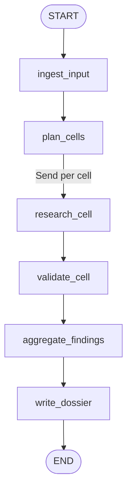

# Meta legal research graph (parallel dossier builder)

## Summary

Add a second, no-HITL LangGraph application that takes jurisdictions + legal domains, expands them into a research cell grid, fans out parallel DeepSeek V4 Flash workers via the Send API, validates each finding against primary-source citations, and writes a durable filesystem dossier of laws and legal text about Meta. Keep the existing HITL personal-automation graph intact; register the new graph in Studio as `meta_legal`.

---

## Problem Frame

Meta operates under a dense, multi-level legal stack (supranational → national → state/city). Building a website-ready global dossier by hand does not scale. The project already has a Studio-ready LangGraph scaffold, but it is HITL personal automation — the wrong shape for bulk research. This plan introduces a dedicated parallel research pipeline optimized for cheap bulk model calls, cell-level independence, and structured on-disk output.

---

## Requirements

- R1. Accept input: list of jurisdictions + list of legal domains (extensible beyond the starter set).
- R2. Expand input into a cartesian **research cell** grid (jurisdiction × domain), with stable cell IDs.
- R3. Research each cell in parallel for laws that **apply to Meta’s business/product categories** in that cell (not only laws that name “Meta”).
- R4. Capture law identity + legal text (or authoritative excerpt) + primary-source citation/URL per entry.
- R5. Validate findings before they enter the dossier (reject or quarantine uncited / low-quality entries).
- R6. Persist a durable **filesystem dossier** suitable for later website generation.
- R7. Default bulk model: **DeepSeek V4 Flash** (`deepseek-v4-flash`) via official API.
- R8. No human-in-the-loop interrupts on this graph.
- R9. Runnable and debuggable in LangSmith Studio alongside the existing graph.
- R10. Structure the graph so later auto-research / pattern experiments can swap worker prompts or validation strategies without redesigning orchestration.

**Starter domains (canonical slugs):**
| Display | Slug |
|---------|------|
| Privacy | `privacy` |
| Competition | `competition` |
| Youth safety | `youth_safety` |
| IP | `ip` |
| Accessibility | `accessibility` |

**Jurisdiction levels in scope when present in input:** supranational, regional, national, state/provincial, city/local.

---

## Scope Boundaries

- Not a lawyer substitute or compliance opinion engine — factual law inventory + text/citations only.
- Not automatic jurisdiction discovery of “everywhere Meta operates” in v1 (user supplies the list).
- No HITL / approval interrupts on this graph.
- No website UI/frontend in this plan.
- No full-text OCR of scanned PDFs in v1 (prefer official HTML/API text sources).
- Do not replace or remove the existing HITL `agent` graph.
- No spend/production side effects beyond model + web research calls.
- **Not** a generic “product safety” domain in v1 — youth safety is the in-scope safety lane (child/teen online safety, age-appropriate design, etc.). Broader product/consumer safety is deferred unless added later as a new domain slug.

### Deferred to Follow-Up Work

- Auto-research quality loops / prompt-pattern experiments over fixed eval cells
- Jurisdiction expansion helpers (EU → members, US → key states)
- DB-backed dossier / search index for the website
- Stronger validator model tier (optional DeepSeek V4 Pro or other) if Flash validation is weak
- Incremental refresh / diff runs against an existing dossier
- Additional domains beyond the five starters (e.g. broader product safety, content moderation, AI governance)

---

## Context & Research

### Relevant Code and Patterns

- Existing Studio multi-export pattern: module-level `graph` without custom checkpointer; `build_graph()` for scripts — `src/langgraph_graph/graph.py`
- Package layout: `src/langgraph_graph/` + `langgraph.json` multi-graph support
- Project skills (authoritative for implementation style):
  - `.agents/skills/langgraph-fundamentals` — StateGraph, reducers, **Send** fan-out
  - `.agents/skills/langgraph-cli` — `langgraph.json` multi-graph registration
  - `.agents/skills/langgraph-persistence` — checkpointer/thread notes if runs need resume
- Keep HITL policy docs as non-applicable to this graph; do not import `interrupt()` into it

### External References

- DeepSeek V4 Preview (official): model IDs `deepseek-v4-flash` / `deepseek-v4-pro`, OpenAI-compatible base URL unchanged — https://api-docs.deepseek.com/news/news260424/
- LangChain DeepSeek integration: `langchain-deepseek` / `ChatDeepSeek` — https://docs.langchain.com/oss/python/integrations/chat/deepseek
- LangGraph Send / map-reduce: https://docs.langchain.com/oss/python/langgraph/use-graph-api#map-reduce-and-the-send-api
- LangGraph fundamentals skill local copy: orchestrator → `[Send("worker", {...})]` → reducer aggregate → synthesize

### Institutional Learnings

- No `docs/solutions/` corpus in this repo yet; treat first implementation as the reference pattern for future research graphs.

---

## Key Technical Decisions

- **Separate graph, same package:** Implement under `src/langgraph_graph/meta_legal/` and register as Studio graph id `meta_legal`. Leaves HITL `agent` untouched.
- **Orchestrator–worker via Send API:** Cartesian cells are independent → dynamic `Send("research_cell", cell)` fan-out with `Annotated[list, operator.add]` (or typed equivalent) on findings. This is the LangGraph-native parallel pattern from project skills.
- **Broad Meta applicability filter:** Include laws that apply to Meta’s product categories / platform obligations in-jurisdiction, not only instruments that name Meta. Tag entries with `meta_nexus` reason (`named_party` | `platform_obligation` | `sector_rule` | …).
- **User-supplied jurisdictions only (v1):** No automatic expansion. Optional normalizer may canonicalize labels (`EU` → `European Union`) but must not invent members/states.
- **Starter domain set (locked):** `privacy`, `competition`, `youth_safety`, `ip`, `accessibility`. Accept free-string extras later; do not ship `product_safety` or `intellectual_property` as canonical slugs.
- **Filesystem dossier (v1):** Write under `data/dossiers/<run_id>/` as JSON (machine) + Markdown (human/website seed). Website can ingest later without a DB migration.
- **Citation-required validation:** A finding without a primary-source URL/citation fails validation and is stored under `rejected/` or `needs_review/` rather than the canonical dossier.
- **DeepSeek V4 Flash for bulk research:** `ChatDeepSeek(model="deepseek-v4-flash")` with `DEEPSEEK_API_KEY`. Prefer **non-thinking** mode for structured extraction speed/cost unless validation quality demands thinking on a second pass.
- **Optional second-pass validator:** Same Flash model first; design interface so a stronger model can replace only the validate node later.
- **Web grounding:** Workers must use tools (search + fetch) rather than unaided parametric recall. Exact tool stack chosen at implement time among: Tavily/Serper/Brave search + HTTP fetch of official pages. Prefer official legislature / regulator domains when ranking sources.
- **Typed cell contracts:** Pydantic models for `ResearchCell`, `LawRecord`, `ValidationResult` so Studio state and dossier schema stay aligned.
- **Concurrency control:** Expose `max_concurrency` via invoke config; default conservatively (e.g. 8–16) to respect DeepSeek rate limits while staying parallel.
- **Failure isolation:** Cell workers catch/return structured errors instead of raising whenever possible, so one bad jurisdiction does not abort the whole superstep fan-in.
- **Validation topology (locked):** Each `research_cell` worker edges to a per-cell `validate_cell` node before fan-in. Keeps validation parallel with research completion; rejected reasons stay attached to the cell. A reduce-stage-only validator is out of scope for v1.
- **No checkpointer on Studio export:** Match existing contract (`graph = compile()` bare). Scripts may use MemorySaver/Sqlite for resume experiments later.

---

## Open Questions

### Resolved During Planning

- HITL? **No** for this graph.
- Model for bulk work? **DeepSeek V4 Flash** (`deepseek-v4-flash`) — confirmed real; official API model id.
- Meta filter? **Broad applicability**, not name-only.
- Jurisdiction expansion? **Strict input list** in v1.
- Storage? **Filesystem dossier**.
- Validation bar? **Primary citation/URL required**.
- Validation placement? **Per-cell** after each research worker.
- Starter domains? **privacy, competition, youth_safety, ip, accessibility** (not product_safety / intellectual_property).

### Deferred to Implementation

- Exact search provider (Tavily vs Serper vs Brave) — pick based on key availability and result quality on a 3-cell smoke test.
- Whether validate is a second LLM call per cell vs rule-based citation checks + selective LLM — measure cost/quality on pilot cells.
- Thinking vs non-thinking mode defaults per node after a small quality bakeoff.
- Canonical jurisdiction ID scheme (ISO 3166 + custom codes for EU/US-CA/etc.).
- How much full legal text to store vs excerpt + source URL (token and copyright practicality).
- Domain aliasing for inputs (`"IP"` / `"intellectual property"` → `ip`, `"youth safety"` → `youth_safety`).

---

## Output Structure

```text
src/langgraph_graph/
  meta_legal/
    __init__.py          # export graph, build_graph
    state.py             # ResearchState, cell/finding models
    models.py            # LawRecord, ValidationResult, DossierManifest
    graph.py             # StateGraph + Send orchestration
    nodes/
      plan_cells.py      # expand jurisdictions × domains
      research_cell.py   # worker: search/fetch/extract
      validate_cell.py   # citation + schema validation
      write_dossier.py   # filesystem writer + manifest
    tools/
      search.py
      fetch.py
    prompts/
      research.md
      validate.md
    llm.py               # ChatDeepSeek factory (flash default)
data/
  dossiers/              # gitignored run outputs
  dossiers/.gitkeep
examples/
  meta_legal_smoke.py
tests/
  meta_legal/
    test_plan_cells.py
    test_graph_compile.py
    test_validate_rules.py
    test_dossier_writer.py
    test_research_worker_unit.py
    test_graph_topology.py
```

---

## High-Level Technical Design

> *Directional guidance for review, not implementation specification.*



**Studio / invoke input (sample):**

```json
{
  "jurisdictions": ["European Union", "United States", "California"],
  "domains": ["privacy", "competition", "youth_safety", "ip", "accessibility"],
  "subject": "Meta"
}
```

`subject` defaults to `"Meta"` so the pipeline can later generalize without a graph rewrite.

**Cell identity:** `cell_id = f"{jurisdiction_id}::{domain_id}"`

**Map-reduce shape (conceptual):**

```text
plan_cells(state) -> cells[]
fanout(state) -> [Send("research_cell", cell) for cell in cells]
research_cell(cell) -> { drafts: [LawRecordDraft...], cell_errors: [...] }
validate_cell(cell_result) -> { accepted: [...], rejected: [...] }
aggregate -> accepted[] + rejected[]
write_dossier -> { dossier_path, manifest }
```

**LawRecord (conceptual fields):**
- `law_id`, `title`, `jurisdiction_id`, `domain_id`
- `meta_nexus` + short rationale
- `citation`, `source_url`, `source_type` (`primary`|`secondary`)
- `text` or `excerpt`, `language`, `effective_date?`, `status?`
- `retrieved_at`, `confidence`, `worker_model`

**Dossier layout (conceptual):**

```text
data/dossiers/<run_id>/
  manifest.json
  cells/<cell_id>/findings.json
  laws/<law_id>.json
  laws/<law_id>.md
  rejected/<cell_id>.json
  index.json
```

---

## Implementation Units

### U1. Package skeleton, models, and Studio registration

**Goal:** Create the `meta_legal` module with typed models and register a compilable empty/linear stub graph in Studio.

**Requirements:** R1, R8, R9

**Dependencies:** None

**Files:**
- Create: `src/langgraph_graph/meta_legal/__init__.py`
- Create: `src/langgraph_graph/meta_legal/models.py`
- Create: `src/langgraph_graph/meta_legal/state.py`
- Create: `src/langgraph_graph/meta_legal/graph.py` (stub compile first, then filled by later units)
- Create: `src/langgraph_graph/meta_legal/llm.py`
- Modify: `langgraph.json` (add `meta_legal` graph entry)
- Modify: `pyproject.toml` (add `langchain-deepseek`, search/fetch deps as chosen)
- Modify: `.env.example` (`DEEPSEEK_API_KEY`, optional search keys, `DOSSIER_ROOT`)
- Modify: `.gitignore` (`data/dossiers/*` keep `.gitkeep`)
- Modify: `README.md` / `AGENTS.md` (second graph docs)
- Test: `tests/meta_legal/test_graph_compile.py`

**Approach:**
- Define Pydantic models for input, cells, law records, validation results, manifest.
- Starter domain constants/enum: `privacy`, `competition`, `youth_safety`, `ip`, `accessibility`.
- Use TypedDict/Pydantic state with reducers for parallel list fields.
- Export module-level `graph` (no checkpointer) and `build_graph()` for scripts.
- LLM factory defaults to `ChatDeepSeek(model="deepseek-v4-flash")`.

**Test scenarios:**
- Happy path: importing `meta_legal.graph` yields a compiled graph; `langgraph.json` lists `meta_legal`.
- Happy path: default domain set is exactly privacy, competition, youth_safety, ip, accessibility; free-string extras still accepted.
- Edge case: empty jurisdictions or domains rejected by input validation model.
- Integration: `langgraph dev` loads both `agent` and `meta_legal` assistants.

**Verification:** Studio shows `meta_legal`; unit tests import/compile without API calls.

---

### U2. Cell planner (cartesian expansion + normalization)

**Goal:** Turn jurisdiction/domain lists into stable research cells.

**Requirements:** R1, R2

**Dependencies:** U1

**Files:**
- Create: `src/langgraph_graph/meta_legal/nodes/plan_cells.py`
- Modify: `src/langgraph_graph/meta_legal/graph.py`
- Test: `tests/meta_legal/test_plan_cells.py`

**Approach:**
- Normalize whitespace/case; optional alias map for jurisdictions (`EU`→`European Union`, `US`→`United States`) without adding children.
- Domain aliases: `"IP"` / `"intellectual property"` → `ip`; `"youth safety"` → `youth_safety`; reject or remap legacy `product_safety` only if explicitly requested later (not a starter).
- Emit `ResearchCell` objects with `cell_id`, `jurisdiction`, `domain`, `status=pending`.
- Deduplicate identical pairs.

**Test scenarios:**
- Happy path: 2 jurisdictions × 3 domains → 6 unique cells with deterministic IDs.
- Happy path: input domains `["IP", "Youth Safety"]` normalize to `ip`, `youth_safety`.
- Edge case: duplicate inputs collapse to unique cells.
- Edge case: alias normalization does not invent member states.
- Error path: all-empty after normalize → structured graph error / empty-cell halt.

**Verification:** Planner unit tests green; Studio run with sample input shows `cells` populated before workers.

---

### U3. Research tools + parallel research worker

**Goal:** For each cell, search and extract candidate laws with citations using DeepSeek V4 Flash + tools.

**Requirements:** R3, R4, R7, R10

**Dependencies:** U2

**Files:**
- Create: `src/langgraph_graph/meta_legal/tools/search.py`
- Create: `src/langgraph_graph/meta_legal/tools/fetch.py`
- Create: `src/langgraph_graph/meta_legal/nodes/research_cell.py`
- Create: `src/langgraph_graph/meta_legal/prompts/research.md`
- Modify: `src/langgraph_graph/meta_legal/graph.py` (Send fan-out from planner)
- Test: `tests/meta_legal/test_research_worker_unit.py` (mocked tools/LLM)

**Approach:**
- Wire conditional edge / Send fan-out: one worker invocation per cell.
- Worker prompt forces: jurisdiction lock, domain lock (including youth-safety framing for `youth_safety`, IP framing for `ip`), Meta applicability rationale, primary sources preferred, structured output matching `LawRecordDraft`.
- Tool loop: search → select official candidates → fetch page text → extract records.
- Return drafts via reducer-friendly list update; never raise on soft failures.
- Parameterize prompt path so later auto-research can swap patterns.

**Execution note:** Mock tools/LLM in unit tests; one optional live smoke behind env flag later in U6.

**Test scenarios:**
- Happy path (mocked): worker returns ≥1 draft with source_url and meta_nexus.
- Happy path: Send fan-out schedules N workers for N cells (graph structure / command list assertion).
- Edge case: search returns nothing → empty drafts + cell warning, not crash.
- Error path: fetch failure on one URL still returns other drafts from the cell.
- Integration: `max_concurrency` respected when invoking with multiple cells (config plumbing).

**Verification:** Mocked worker tests pass; local Studio run on 1–2 cheap cells produces draft findings in state.

---

### U4. Validation gate

**Goal:** Accept only well-formed, cited findings into the canonical set.

**Requirements:** R5, R4

**Dependencies:** U3

**Files:**
- Create: `src/langgraph_graph/meta_legal/nodes/validate_cell.py`
- Create: `src/langgraph_graph/meta_legal/prompts/validate.md`
- Modify: `src/langgraph_graph/meta_legal/graph.py` (wire per-cell `research_cell` → `validate_cell` edge)
- Test: `tests/meta_legal/test_validate_rules.py`

**Approach:**
- Place `validate_cell` **immediately after** each `research_cell` (per-cell edge), not as a single post-reduce gate.
- Deterministic rules first: required fields, URL present, domain/jurisdiction match cell, reject pure secondary blogs when primary missing.
- Optional LLM adjudicator (Flash) for borderline nexus/applicability.
- Split outputs into `accepted` and `rejected` with reasons.
- Keep interface model-swappable for later stronger validators.

**Test scenarios:**
- Happy path: cited primary record → accepted.
- Edge case: missing URL → rejected with reason `missing_citation`.
- Edge case: jurisdiction mismatch between cell and record → rejected.
- Edge case: Meta nexus absent/unclear → rejected or needs_review per rule table.
- Error path: malformed worker payload does not crash validator.

**Verification:** Rule tests cover accept/reject matrix without network.

---

### U5. Dossier writer

**Goal:** Persist accepted/rejected findings to a website-friendly filesystem dossier.

**Requirements:** R6

**Dependencies:** U4

**Files:**
- Create: `src/langgraph_graph/meta_legal/nodes/write_dossier.py`
- Test: `tests/meta_legal/test_dossier_writer.py`
- Create: `data/dossiers/.gitkeep`

**Approach:**
- `run_id` from config/thread or generated ULID/timestamp.
- Write manifest (inputs, model, counts, timestamps), per-law JSON/MD, per-cell files, rejected bucket, top-level index.
- Idempotent overwrite within the same `run_id`; never silently merge different runs.
- Return `dossier_path` in graph output state.

**Test scenarios:**
- Happy path: temp directory receives manifest + law files for accepted records.
- Happy path: rejected records land only under `rejected/`.
- Edge case: zero accepted findings still writes manifest with counts.
- Edge case: filesystem-safe encoding of cell/law IDs (slashes, spaces).
- Error path: unwritable root surfaces a clear error.

**Verification:** Writer tests use tmp paths; smoke run leaves inspectable dossier on disk.

---

### U6. End-to-end wiring, example, and smoke path

**Goal:** Fully wire nodes, document how to run, and prove a tiny real (or recorded) end-to-end path.

**Requirements:** R1–R10

**Dependencies:** U1–U5

**Files:**
- Modify: `src/langgraph_graph/meta_legal/graph.py` (final topology)
- Create: `examples/meta_legal_smoke.py`
- Modify: `README.md`, `AGENTS.md`
- Test: `tests/meta_legal/test_graph_topology.py`

**Approach:**
- Final edges: `ingest` → `plan_cells` → **Send** → `research_cell` → `validate_cell` → reduce/aggregate → `write_dossier` → END. Validation is **per-cell**.
- Example invokes with a tiny fixture (e.g. `["European Union","United States"]` × `["privacy"]`) and prints dossier path.
- Document Studio input schema with the five starter domains and required env vars.
- Default concurrency and timeouts documented.

**Test scenarios:**
- Happy path: compiled graph node set includes planner, research worker, validator, writer.
- Integration (mocked LLM/tools): full invoke with 2 cells writes dossier and returns path.
- Integration (optional live): env-gated smoke against DeepSeek + search for 1 cell.
- Unchanged invariant: existing `agent` HITL graph still imports and compiles.

**Verification:** `uv run pytest tests/meta_legal` green; optional live smoke succeeds with keys present; Studio can run `meta_legal`.

---

## System-Wide Impact

- **Interaction graph:** New Studio assistant `meta_legal`; existing `agent` unchanged. Shared package import surface grows.
- **Error propagation:** Prefer per-cell structured errors over hard fails; writer/manifest still produced on partial success.
- **State lifecycle risks:** Large fan-out can bloat in-memory state with full legal texts — store excerpts in graph state if needed, full text only on disk.
- **API surface parity:** CLI example + Studio both use same module-level `graph`.
- **Integration coverage:** Mocked unit/topology tests + one optional live smoke; full global runs are manual/ops.
- **Unchanged invariants:** HITL policy remains mandatory for the personal-automation graph; this research graph is explicitly exempt and isolated.

---

## Risks & Dependencies

| Risk | Likelihood | Impact | Mitigation |
|------|-----------|--------|------------|
| Hallucinated laws / bad citations | High | High | Tool-grounded research + citation-required validation + rejected bucket |
| DeepSeek / search rate limits on large grids | Med | Med | `max_concurrency`, retries, cell-level soft fail |
| Copyright / bulk storage of full statutes | Med | Med | Prefer excerpts + canonical URLs; configurable text retention |
| Cost blowups on huge jurisdiction×domain grids | Med | Med | Start small; estimate cells before run; cheap Flash default |
| Search provider lock-in | Low | Med | Thin tool interface in `tools/search.py` |
| Parallel superstep abort on uncaught exception | Med | High | Catch in workers; return error objects |
| Model docs lag in third-party pages | Low | Low | Pin official model id `deepseek-v4-flash` from DeepSeek API docs |
| Youth-safety scope creep into general product safety | Med | Med | Domain slug + prompts locked to youth/child online safety framing |

---

## Documentation / Operational Notes

- README: how to select `meta_legal` in Studio, required env (`DEEPSEEK_API_KEY`, search key), sample input JSON with the five domains, dossier path.
- AGENTS: this graph is no-HITL by design; do not add `interrupt()` here.
- Ops: large runs should set `max_concurrency` and monitor LangSmith traces.
- Git: dossier outputs ignored; only schema/examples committed.
- Later quality work: treat prompts + validate rules as experiment surfaces; keep orchestration stable.

---

## Alternative Approaches Considered

- **Single-agent Deep Agents loop:** Faster to prototype, weaker explicit cell grid / dossier contract, harder deterministic parallelism — rejected for v1 core.
- **DB-first dossier (SQLite/Postgres):** Better queryability now; slower to ship and unnecessary before website — deferred.
- **Name-only Meta filter:** Higher precision, large recall miss on platform laws — rejected per product goal.
- **langgraph `interrupt()` review between cells:** User requested no HITL.
- **“Product safety” as a starter domain:** Superseded by **youth safety** per product direction.

---

## Success Metrics

- 2×2 pilot (2 jurisdictions × 2 domains) completes with parallel workers and a non-empty accepted dossier **or** explicit rejected reasons.
- ≥90% of accepted records include a dereferenceable `source_url`.
- Existing HITL `agent` graph still loads in Studio.
- Cell planning and validation covered by automated tests without network.
- Starter domain constants match: privacy, competition, youth_safety, ip, accessibility.

---

## Dependencies / Prerequisites

- `DEEPSEEK_API_KEY` for live runs
- Search provider API key (chosen in U3)
- Network egress for search/fetch
- Existing Studio/dev server workflow already set up in this repo

---

## Phased Delivery

### Phase 1
- U1–U2: models, registration, cell planner (safe offline progress)

### Phase 2
- U3–U4: parallel research + validation (core quality loop)

### Phase 3
- U5–U6: dossier persistence, example, docs, smoke

---

## Sources & References

- Related code: `src/langgraph_graph/graph.py`, `langgraph.json`
- Skills: `.agents/skills/langgraph-fundamentals`, `.agents/skills/langgraph-cli`
- External docs:
  - https://api-docs.deepseek.com/news/news260424/
  - https://docs.langchain.com/oss/python/integrations/chat/deepseek
  - https://docs.langchain.com/oss/python/langgraph/use-graph-api#map-reduce-and-the-send-api
